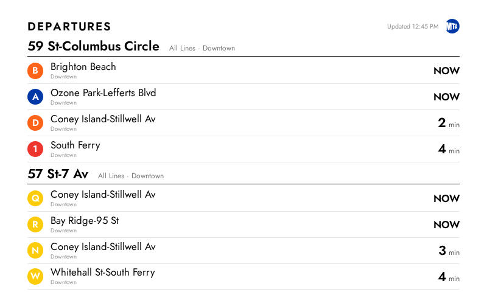

# InkyPi-SubwayDepartures

An [InkyPi](https://github.com/fatihak/InkyPi) plugin that displays a real-time NYC subway departure board using MTA live data.



## Features

- Build a custom departure board with multiple stations, lines, and directions
- Stations are grouped by MTA station complex (e.g. Columbus Circle shows 1/A/B/C/D together)
- Filter by specific subway lines and/or direction per station
- Real-time departure data from the MTA GTFS-RT feeds via [py-nymta](https://github.com/OnFreund/py-nymta)
- Station index sourced from the official [MTA Stations dataset](https://data.ny.gov/Transportation/MTA-Subway-Stations/39hk-dx4f) with local caching
- MTA-colored line badges and official MTA logo on the display
- Supports all NYC subway lines and Staten Island Railway
- No API key required for subway data

## Installation

Install the plugin using the InkyPi CLI:

```bash
inkypi-plugin install subway_departures https://github.com/GrmpPnda/InkyPi-SubwayDepartures
```

Then install the Python dependency:

```bash
pip install py-nymta
```

## Dependencies

- [py-nymta](https://github.com/OnFreund/py-nymta) — Python library for accessing MTA real-time transit data (no API key needed for subway feeds)

## Usage

1. Open the InkyPi web UI and select the **Subway Departures** plugin
2. Use the station picker to search for a station
3. Select which lines and direction you want to watch
4. Click **Add to Board** — repeat for additional stations
5. Set the max number of departures to display
6. Save to your playlist

## Status

Actively maintained.

## License

This project is licensed under the MIT License.
